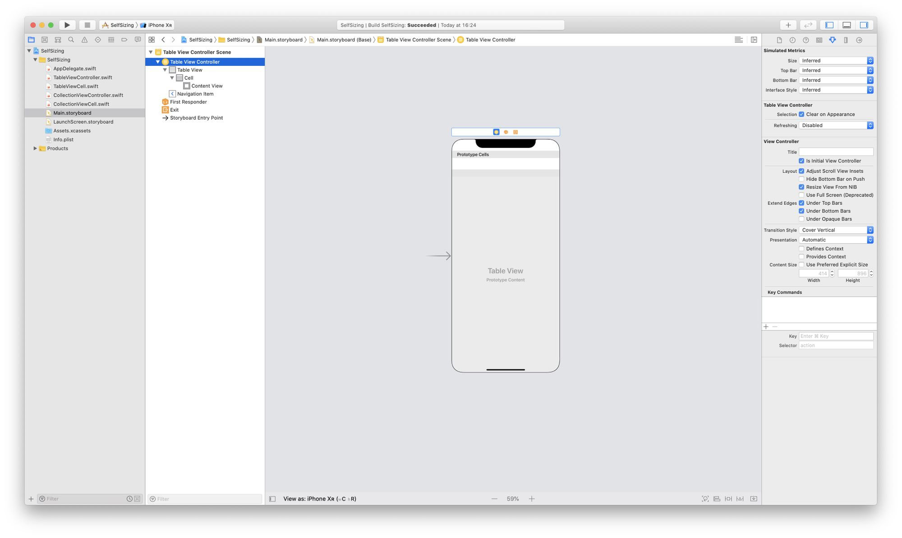
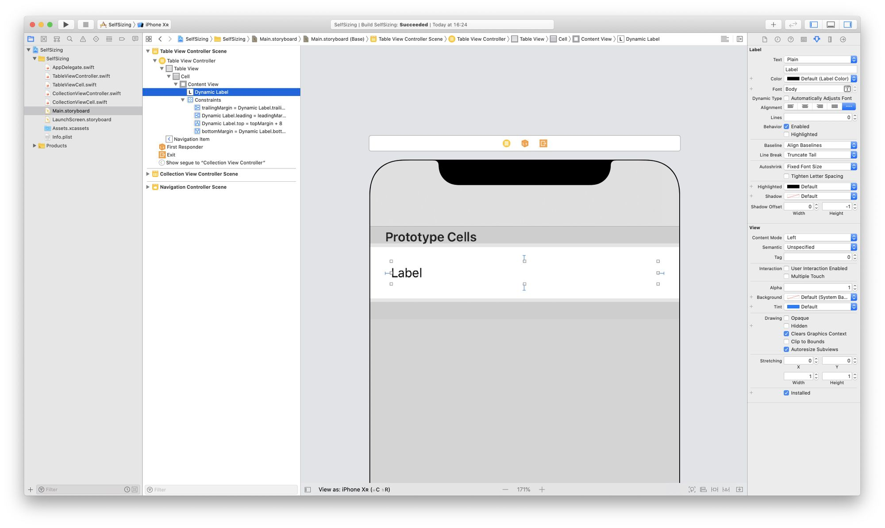
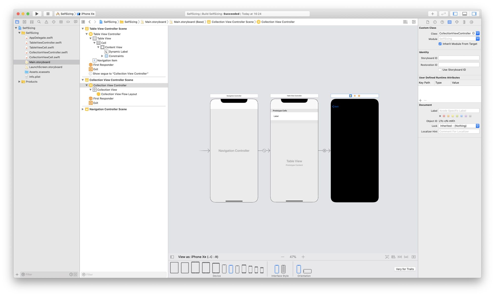

## UITableView

So let's start with a standard single-view template for iOS. Name the project, and go straight to the `Main.storyboard` file. Select your view controller, delete it and create a new `UITableViewController` scene.



Set the table view controller scene as initial view controller and create a `TableViewController.swift` file with the corresponding class.

```swift
import UIKit

class TableViewController: UITableViewController {

    var dataSource: [String] = [
        "Donec id elit non mi porta gravida at eget metus.",
        "Integer posuere erat a ante venenatis dapibus posuere velit aliquet. Cum sociis natoque penatibus et magnis dis parturient montes, nascetur ridiculus mus.",
        "Duis mollis, est non commodo luctus, nisi erat porttitor ligula, eget lacinia odio sem nec elit. Vestibulum id ligula porta felis euismod semper. Nullam id dolor id nibh ultricies vehicula ut id elit. Nullam quis risus eget urna mollis ornare vel eu leo.",
        "Maecenas faucibus mollis interdum.",
        "Donec ullamcorper nulla non metus auctor fringilla. Aenean lacinia bibendum nulla sed consectetur. Cras mattis consectetur purus sit amet fermentum.",
        "Cum sociis natoque penatibus et magnis dis parturient montes, nascetur ridiculus mus. Maecenas faucibus mollis interdum.",
    ]
}

extension TableViewController {

    override func tableView(
        _ tableView: UITableView, 
        numberOfRowsInSection section: Int
    ) -> Int {
        return dataSource.count
    }

    override func tableView(
        _ tableView: UITableView, 
        cellForRowAt indexPath: IndexPath
    ) -> UITableViewCell {
        let cell = tableView.dequeueReusableCell(
            withIdentifier: "Cell", 
            for: indexPath
        ) as! TableViewCell

        cell.dynamicLabel?.text = dataSource[indexPath.row]
        cell.dynamicLabel.font  = UIFont.preferredFont(forTextStyle: .body)

        return cell
    }
}
```

The setup is really self-descriptive. You've got a string array as data source, and the required implementation of the `UITableViewDataSource` protocol.

The only thing that is missing is the `TableViewCell` class.

```swift
class TableViewCell: UITableViewCell {

    @IBOutlet weak var dynamicLabel: UILabel!
}
```

First, create the class itself, then with interface builder select the table view controller scene and drag a label to the prototype cell. Set the class of the prototype cell to `TableViewCell`. The reusable identifier can be simply `"Cell"`. Connect the dynamicLabel outlet to the view. Give the label top, bottom, leading, trailing constraints to the superview with the default value of 8. Select the label, set the font to body style and the lines property to zero. That's how simple it is. 😂



Now you are almost ready. You just need to set the estimated row height on the table view. Inside the TableViewController class change the `viewDidLoad` method like this:

```swift
override func viewDidLoad() {
    super.viewDidLoad()

    tableView.estimatedRowHeight = 44
    tableView.rowHeight = UITableView.automaticDimension
}
```

The `estimatedRowHeight` property will tell the system that the table view should try to figure out the [height of each cell dynamically](https://www.natashatherobot.com/ios-8-self-sizing-table-view-cells-with-dynamic-type/). You should also change the rowHeight property to automatic dimension, if you don't do then the system will use a static cell height - that one from interface builder that you can set on the cell. Now build & run. You have a wonderful table view with self sizing cells. You can even rotate your device, it's going to work in both orientations.

> One more thing

If you change the text size under the iOS accessibility settings, the table view will reflect the changes, so it'll adapt the layout to the new value. The font size of the table view is going to change according to the slider value. You might want to subscribe to the `UIContentSizeCategory.didChangeNotification` in order to detect size changes and reload the UI. This feature is called dynamic type.

```swift
NotificationCenter.default.addObserver(
    self.tableView, 
    selector: #selector(UITableView.reloadData), 
    name: UIContentSizeCategory.didChangeNotification, 
    object: nil
)
```

## UICollectionView

So we've finished the easy part. Now let's try to achieve the [same functionality](https://www.raywenderlich.com/129059/self-sizing-table-view-cells) with a collection view. `UICollectionView` is a generic class, that is designed to create custom layouts, because of this generic behavior you will not be able to create self sizing cells from interface builder. You have to do it from code.

Before we start, we can still play with IB a little bit. Create a new collection view controller scene, and drag a push segue from the previous table view cell to this new controller. Finally embed the whole thing in a navigation controller.



The cell is going to be the exact same as we used for the table view, but it's a subclass of `UICollectionViewCell`, and we are going to construct the layout directly from code.

```swift
class CollectionViewCell: UICollectionViewCell {

    weak var dynamicLabel: UILabel!

    required init?(coder aDecoder: NSCoder) {
        fatalError("init(coder:) has not been implemented")
    }

    override init(frame: CGRect) {
        super.init(frame: frame)

        translatesAutoresizingMaskIntoConstraints = false

        let label = UILabel(frame: bounds)
        label.translatesAutoresizingMaskIntoConstraints = false
        label.font = UIFont.preferredFont(forTextStyle: .body)
        label.backgroundColor = UIColor.darkGray
        label.numberOfLines = 0
        label.preferredMaxLayoutWidth = frame.size.width

        self.contentView.addSubview(label)
        self.dynamicLabel = label

        NSLayoutConstraint.activate([
            contentView.topAnchor.constraint(
                equalTo: dynamicLabel.topAnchor
            ),
            contentView.bottomAnchor.constraint(
                equalTo: dynamicLabel.bottomAnchor
            ),
            contentView.leadingAnchor.constraint(
                equalTo: dynamicLabel.leadingAnchor
            ),
            contentView.trailingAnchor.constraint(
                equalTo: dynamicLabel.trailingAnchor
            ),
        ])
    }

    override func prepareForReuse() {
        super.prepareForReuse()

        dynamicLabel.font = UIFont.preferredFont(forTextStyle: .body)
    }

    func setPreferred(width: CGFloat) {
        dynamicLabel.preferredMaxLayoutWidth = width
    }
}
```

We have a subclass for our cell, now let's create the view controller class. Inside the viewDidLoad method you have to set the estimatedItemSize property on the collection view. There if you give wrong size, the auto-rotation won't work as expected.

```swift
override func viewDidLoad() {
    super.viewDidLoad()

    navigationItem.rightBarButtonItem = UIBarButtonItem(
        barButtonSystemItem: .refresh, 
        target: self,
        action: #selector(toggleColumns)
    )

    collectionView?.register(
        CollectionViewCell.self, 
        forCellWithReuseIdentifier: "Cell"
    )

    if let flowLayout = collectionView?.collectionViewLayout as? UICollectionViewFlowLayout {
        flowLayout.itemSize = CGSize(width: 64, height: 64)
        flowLayout.minimumInteritemSpacing = 10
        flowLayout.minimumLineSpacing = 20
        flowLayout.sectionInset = UIEdgeInsets(
            top: 10, 
            left: 10, 
            bottom: 10, 
            right: 10
        )
        flowLayout.estimatedItemSize = CGSize(
            width: preferredWith(forSize: view.bounds.size), 
            height: 64
        )
    }

    collectionView?.reloadData()

    NotificationCenter.default.addObserver(
        collectionView!, 
        selector: #selector(UICollectionView.reloadData), 
        name: UIContentSizeCategory.didChangeNotification, 
        object: nil
    )
}
```

Inside the rotation methods, you have to invalidate the collection view layout, and recalculate the visible cell sizes when the transition happens.

```swift
override func traitCollectionDidChange(
    _ previousTraitCollection: UITraitCollection?
) {
    super.traitCollectionDidChange(previousTraitCollection)

    guard
        let previousTraitCollection = previousTraitCollection,
        traitCollection.verticalSizeClass != previousTraitCollection.verticalSizeClass ||
        traitCollection.horizontalSizeClass != previousTraitCollection.horizontalSizeClass
    else {
        return
    }

    collectionView?.collectionViewLayout.invalidateLayout()
    collectionView?.reloadData()
}

override func viewWillTransition(
    to size: CGSize, 
    with coordinator: UIViewControllerTransitionCoordinator
) {
    super.viewWillTransition(to: size, with: coordinator)

    collectionView?.collectionViewLayout.invalidateLayout()
    estimateVisibleCellSizes(to: size)

    coordinator.animate(alongsideTransition: { context in

    }, completion: { context in
        collectionView?.collectionViewLayout.invalidateLayout()
    })
}
```

There are two helper methods to calculate the preferred width for the estimated item size and to recalculate the visible cell sizes.

```swift
func preferredWith(forSize size: CGSize) -> CGFloat {
    var columnFactor: CGFloat = 1.0
    if twoColumns {
        columnFactor = 2.0
    }
    return (size.width - 30) / columnFactor
}

func estimateVisibleCellSizes(to size: CGSize) {
    guard let collectionView else {
        return
    }

    if let flowLayout = collectionView?.collectionViewLayout as? UICollectionViewFlowLayout {
        flowLayout.estimatedItemSize = CGSize(
            width: preferredWith(forSize: size), 
            height: 64
        )
    }

    collectionView.visibleCells.forEach { cell in
        if let cell = cell as? CollectionViewCell {
            cell.setPreferred(width: preferredWith(forSize: size))
        }
    }
}
```

You can even have multiple columns if you do the appropriate calculations.

There is only one thing that I could not solve, but that's just a log message. If you rotate back the device some of the cells are not going to be visible and the layout engine will complain about that those cells can not be snapshotted.

> Snapshotting a view that has not been rendered results in an empty snapshot. Ensure your view has been rendered at least once before snapshotting or snapshot after screen updates.

If you can make this message disappear somehow `OS_ACTIVITY_MODE=disable`, please don't hesitate to submit a pull request for the tutorials repository on [GitHub](https://github.com/theswiftdev/tutorials). 😉
