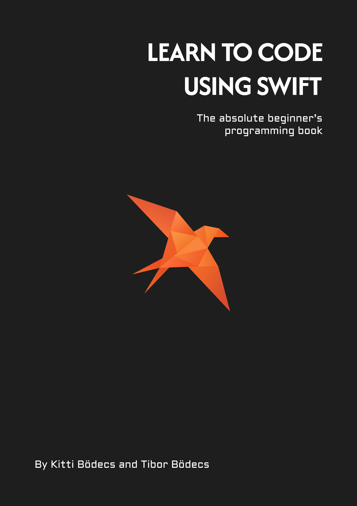

@Grid(
    desktop: 2,
    tablet: 2,
    mobile: 1
) {
    @Column {
         
    }
    @Column {
         
        
        # Learn To Code  Using Swift
        
        Learn To Code Using Swift is a programming book for absolute beginners, born from a fresh approach. It promises beginner-friendly explanations even for complex topics and provides up-to-date Swift knowledge. The book builds progressively from the basics to advanced concepts without expecting any prior programming experience — it clearly explains every idea, definition, and code snippet. It also teaches algorithmic thinking and reasoning skills necessary to thrive even in the age of LLMs. Theory and practice go hand in hand, with more than 350 exercises included to build confidence and solid foundations. Most of the modern Swift language features are covered, making this book a great base for anyone regardless of specific platform or interest.
        
        [Download sample](/assets/learn-to-code-using-swift/sample.pdf)

        <a href="https://theswiftdev.gumroad.com/l/learn-to-code-using-swift" class="cta" target="_blank">Available on Gumroad</a>
        
    }
}

        
